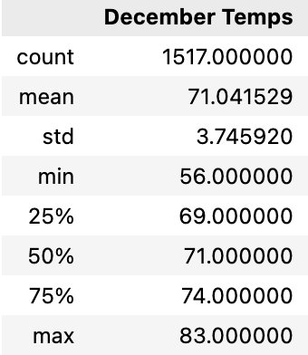
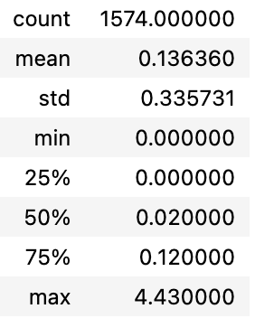
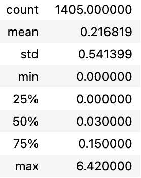

# surfs_up

## Overview

This analysis of weather data for the island of Oahu was requested by investor W. Avy. Before making the commitment to invest in a surf shop, Surf and Shake, the investor has requested a more thorough review of temperatures and weather on the island, in order to make sure the investment is sound and the surf shop won't be rained out shortly after opening. 

## Analysis

### Results

From the analysis of the weather data we can see the varations in June and December temperatures on average below:

 

- On average the highest temperature varies by two degrees, with 83 being the high for December and 85 the high for June
- The low for June is 64 on average, compared to 56 in December
- The average recorded temperatures are in the 70's for both June and December

In order to assuage investor W. Avy's concerns about potentially being rained out of the shop after opening, a further analysis was done comparing rainfall amounts for June (left) and December (right).

 

From these images, we can see that on average both June and December receive less than an inch of rain. However, we can also see that on average December has a higher maximum amount of rainfall, with 6.4 inches, compared to June's average high of 4.4 inches. 

## Summary

From the analysis of the weather data for the island of Oahu, we can see that months of June and December are closely aligned in terms of weather and rain patterns. There is only a slight variation in terms of average maximum rainfall, which can be attributed to December being in the middle of Oahu's rainy season.  

### For Further Consideration

After reviewing the weather data for the island of Oahu, it can be concluded that the average temperature doesn't fluctuate much between June and December as seen from the provided images. However, depending on which side of the island the surf shop will be located, leeward or windward, more research should be done into the wind patterns and best surf spots available. 

